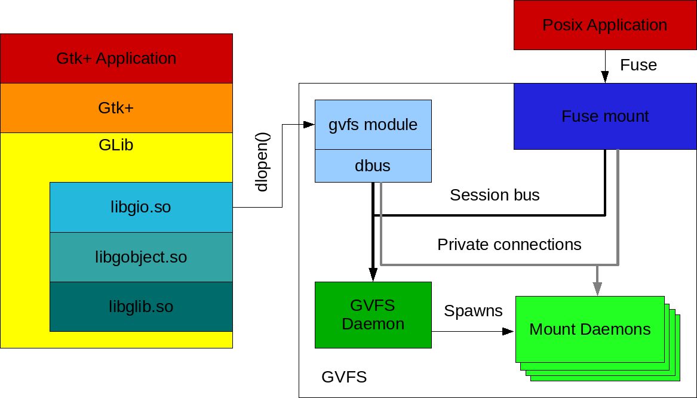

Title: Overview
SPDX-License-Identifier: LGPL-2.1-or-later
SPDX-FileCopyrightText: 2007, 2008, 2010, 2011, 2012, 2013 Matthias Clasen
SPDX-FileCopyrightText: 2007, 2009 Alexander Larsson
SPDX-FileCopyrightText: 2008 A. Walton
SPDX-FileCopyrightText: 2010 David Zeuthen
SPDX-FileCopyrightText: 2013 Stef Walter
SPDX-FileCopyrightText: 2015 Collabora, Ltd.
SPDX-FileCopyrightText: 2016 Colin Walters
SPDX-FileCopyrightText: 2020 Wouter Bolsterlee
SPDX-FileCopyrightText: 2022 Endless OS Foundation, LLC

# Overview

GIO is striving to provide a modern, easy-to-use VFS API that sits at the
right level in the library stack, as well as other generally useful APIs
for desktop applications (such as networking and D-Bus support). The goal
is to overcome the shortcomings of GnomeVFS and provide an API that is so
good that developers prefer it over raw POSIX calls. Among other things
that means using [class@GObject.Object]. It also means not cloning the POSIX API, but
providing higher-level, document-centric interfaces.

The abstract file system model of GIO consists of a number of interfaces and
base classes for I/O and files:

[iface@Gio.File]
: reference to a file

[class@Gio.FileInfo]
: information about a file or filesystem

[class@Gio.FileEnumerator]
: list files in directories

[iface@Gio.Drive]
: represents a drive, which may contain zero or more volumes

[iface@Gio.Volume]
: represents a file system, which may have a mount

[iface@Gio.Mount]
: represents a mounted file system

Then there is a number of stream classes, similar to the input and output
stream hierarchies that can be found in frameworks like Java:

[class@Gio.InputStream]
: read data

[class@Gio.OutputStream]
: write data

[class@Gio.IOStream]
: read and write data

[iface@Gio.Seekable]
: interface optionally implemented by streams to support seeking

There are interfaces related to applications and the types of files they
handle:

[iface@Gio.AppInfo]
: information about an installed application

[iface@Gio.Icon]
: abstract type for file and application icons

There is a framework for storing and retrieving application settings:

[class@Gio.Settings]
: stores and retrieves application settings

There is support for network programming, including connectivity monitoring,
name resolution, low-level socket APIs and high-level client and server helper
classes:

[class@Gio.Socket]
: low-level platform independent socket object

[class@Gio.Resolver]
: asynchronous and cancellable DNS resolver

[class@Gio.SocketClient]
: high-level network client helper

[class@Gio.SocketService]
: high-level network server helper

[class@Gio.SocketConnection]
: network connection stream

[iface@Gio.NetworkMonitor]
: network connectivity monitoring

There is support for connecting to
[D-Bus](https://www.freedesktop.org/wiki/Software/dbus/), sending and receiving
messages, owning and watching bus names, and making objects available on the bus:

[class@Gio.DBusConnection]
: a D-Bus connection

[class@Gio.DBusMethodInvocation]
: for handling remote calls

[class@Gio.DBusServer]
: helper for accepting connections

[class@Gio.DBusProxy]
: proxy to access D-Bus interfaces on a remote object

Beyond these, GIO provides facilities for file monitoring, asynchronous I/O
and filename completion. In addition to the interfaces, GIO provides
implementations for the local case. Implementations for various network file
systems are provided by the GVFS package as loadable modules.

Other design choices which consciously break with the GnomeVFS design are to
move backends out-of-process, which minimizes the dependency bloat and makes
the whole system more robust. The backends are not included in GIO, but in
the separate GVFS package. The GVFS package also contains the GVFS daemon,
which spawn further mount daemons for each individual connection.

The GIO model of I/O is stateful: if an application establishes e.g. a SFTP
connection to a server, it becomes available to all applications in the
session; the user does not have to enter their password over and over again.

One of the big advantages of putting the VFS in the GLib layer is that GTK
can directly use it, e.g. in the file chooser.

## Writing GIO applications

The information in the GLib documentation about
[writing GLib applications](https://docs.gtk.org/glib/programming.html) is
generally applicable when writing GIO applications.

### Threads

GDBus has its own private worker thread, so applications using GDBus have at
least 3 threads. GIO makes heavy use of the concept of a thread-default main
context to execute callbacks of asynchronous methods in the same context in
which the operation was started.

### Asynchronous Programming

Many GIO functions come in two versions: synchronous and asynchronous,
denoted by an `_async` suffix. It is important to use these appropriately:
synchronous calls should not be used from within a main loop which is shared
with other code, such as one in the application’s main thread. Synchronous
calls block until they complete, and I/O operations can take noticeable
amounts of time (even on ‘fast’ SSDs). Blocking a main loop iteration while
waiting for I/O means that other sources in the main loop will not be
dispatched, such as input and redraw handlers for the application’s UI. This
can cause the application to ‘freeze’ until I/O completes.

A few self-contained groups of functions, such as code generated by
[`gdbus-codegen`](gdbus-codegen.html), use a different convention: functions are asynchronous
default, and it is the synchronous version which has a `_sync` suffix. Aside
from naming differences, they should be treated the same way as functions
following the normal convention above.

The asynchronous (`_async`) versions of functions return control to the
caller immediately, after scheduling the I/O in the kernel and adding a
callback for it to the main loop. This callback will be invoked when the
operation has completed. From the callback, the paired `_finish` function
should be called to retrieve the return value of the I/O operation, and any
errors which occurred. For more information on using and implementing
asynchronous functions, see [iface@Gio.AsyncResult] and [class@Gio.Task].

By starting multiple asynchronous operations in succession, they will be
executed in parallel (up to an arbitrary limit imposed by GIO’s internal
worker thread pool).

The synchronous versions of functions can be used early in application
startup when there is no main loop to block, for example to load initial
configuration files. They can also be used for I/O on files which are
guaranteed to be small and on the local disk. Note that the user’s home
directory is not guaranteed to be on the local disk.

### Security

When your program needs to carry out some privileged operation (say, create
a new user account), there are various ways in which you can go about this:

- Implement a daemon that offers the privileged operation. A convenient way
  to do this is as a D-Bus system-bus service. The daemon will probably need
  ways to check the identity and authorization of the caller before
  executing the operation.
  [polkit](https://www.freedesktop.org/software/polkit/docs/latest/polkit.8.html)
  is a framework that allows this.
- Use a small helper that is executed with elevated privileges via `pkexec`.
  [`pkexec`](https://www.freedesktop.org/software/polkit/docs/latest/pkexec.1.html)
  is a small program launcher that is part of polkit.
- Use a small helper that is executed with elevated privileges by being SUID
  root.

None of these approaches is the clear winner, they all have their advantages
and disadvantages.

When writing code that runs with elevated privileges, it is important to
follow some basic rules of secure programming. David Wheeler has an
excellent book on this topic,
[Secure Programming for Linux and Unix HOWTO](https://dwheeler.com/secure-programs/Secure-Programs-HOWTO/index.html).

When using GIO in code that runs with elevated privileges, you have to be
careful. GIO has extension points whose implementations get loaded from
modules (executable code in shared objects), which could allow an attacker
to sneak their own code into your application by tricking it into loading the
code as a module. However, GIO will never load modules from your home
directory except when explicitly asked to do so via an environment variable.

In most cases, your helper program should be so small that you don’t need
GIO, whose APIs are largely designed to support full-blown desktop
applications. If you can’t resist the convenience of these APIs, here are
some steps you should take:

- Clear the environment, e.g. using the `clearenv()` function. David Wheeler
  has a good
  [explanation](https://dwheeler.com/secure-programs/Secure-Programs-HOWTO/environment-variables.html)
  for why it is important to sanitize the environment. See the section on
  running GIO applications for a list of all environment variables affecting
  GIO. In particular, `PATH` (used to locate binaries), `GIO_EXTRA_MODULES`
  (used to locate loadable modules) and `DBUS_{SYSTEM,SESSION}_BUS_ADDRESS`
  (used to locate the D-Bus system and session bus) are important.
- Don’t use GVfs, by setting `GIO_USE_VFS=local` in the environment. The
  reason to avoid GVfs in security-sensitive programs is that it uses many
  libraries which have not necessarily been audited for security problems.
  Gvfs is also heavily distributed and relies on a session bus to be
  present.

## Compiling GIO applications

GIO comes with a `gio-2.0.pc` file that you should use together with
pkg-config to obtain the necessary information about header files and
libraries. See the [pkg-config man page](man:pkg-config(1)) or the
[GLib documentation](https://docs.gtk.org/glib/compiling.html) for more
information on how to use pkg-config to compile your application.

If you are using GIO on Unix-like systems, you may want to use Unix-specific
GIO interfaces such as `GUnixInputStream`, `GUnixOutputStream`, `GUnixMount`
or `GDesktopAppInfo`. To do so, use the `gio-unix-2.0.pc` file as well as
`gio-2.0.pc` (or, in GIR namespace terms, `GioUnix-2.0` as well as `Gio-2.0`).

## Running GIO applications

GIO inspects a few environment variables in addition to the ones used by GLib.

- `XDG_DATA_HOME`, `XDG_DATA_DIRS`.  GIO uses these environment variables to
  locate MIME information. For more information, see the
  [Shared MIME-info Database](https://specifications.freedesktop.org/shared-mime-info-spec/latest/)
  and the [Base Directory Specification](https://specifications.freedesktop.org/basedir-spec/latest/).
- `GVFS_DISABLE_FUSE`.  This variable can be set to keep Gvfs from starting
  the fuse backend, which may be unwanted or unnecessary in certain
  situations.
- `GIO_USE_VFS`.  This environment variable can be set to the name of a GVfs
  implementation to override the default for debugging purposes. The GVfs
  implementation for local files that is included in GIO has the name
  `local`, the implementation in the GVfs module has the name `gvfs`. Most
  commonly, system software will set this to `local` to avoid having [iface@Gio.File]
  APIs perform unnecessary D-Bus calls. The special value `help` can be used
  to print a list of available implementations to standard output.

The following environment variables are only useful for debugging GIO itself
or modules that it loads. They should not be set in a production
environment.

- `GIO_USE_FILE_MONITOR`.  This variable can be set to the name of a
  [class@Gio.FileMonitor] implementation to override the default for debugging
  purposes. The [class@Gio.FileMonitor] implementation for local files that is included
  in GIO on Linux has the name `inotify`, others that are built are built as
  modules (depending on the platform) are called `kqueue` and `win32`. The
  special value `help` can be used to print a list of available
  implementations to standard output.
- `GIO_USE_VOLUME_MONITOR`.  This variable can be set to the name of a
  [class@Gio.VolumeMonitor] implementation to override the default for debugging
  purposes. The [class@Gio.VolumeMonitor] implementation for local files that is
  included in GIO has the name `unix`, the udisks2-based implementation in
  the GVfs module has the name `udisks2`. The special value `help` can be used
  to print a list of available implementations to standard output.
- `GIO_USE_MEMORY_MONITOR`.  This variable can be set to the name of a
  [iface@Gio.MemoryMonitor] implementation to override the default for debugging
  purposes. The available implementations included in GIO have the names
  `dbus`, `portal` and `win32`. The special value `help` can be used
  to print a list of available implementations to standard output.
- `GIO_USE_NETWORK_MONITOR`.  This variable can be set to the name of a
  [iface@Gio.NetworkMonitor] implementation to override the default for debugging
  purposes. The available implementations included in GIO have the names
  `netlink`, `networkmanager` and `portal`. The special value `help` can
  be used to print a list of available implementations to standard output.
- `GIO_USE_POWER_PROFILE_MONITOR`. This variable can be set to the name of a
  [iface@Gio.PowerProfileMonitor] implementation to override the default for debugging
  purposes. The available implementations included in GIO have the names
  `dbus` and `portal`. The special value `help` can be used to print a list
  of available implementations to standard output.
- `GIO_USE_TLS`.  This variable can be set to the name of a [iface@Gio.TlsBackend]
  implementation to override the default for debugging purposes. GIO does
  not include a [iface@Gio.TlsBackend] implementation — the GnuTLS-based implementation
  in the glib-networking module has the name `gnutls`. The special value
  `help` can be used to print a list of available implementations to standard
  output.
- `GIO_USE_PORTALS`.  This variable can be set to override detection of portals
  and force them to be used to provide various bits of GIO functionality, for
  testing and debugging. This variable is not intended to be used in production.
- `GIO_MODULE_DIR`.  When this environment variable is set to a path, GIO
  will load modules from this alternate directory instead of the directory
  built into GIO. This is useful when running tests, for example. This
  environment variable is ignored when running in a SUID program.
- `GIO_EXTRA_MODULES`.  When this environment variable is set to a path, or
  a set of paths separated by a colon, GIO will attempt to load additional
  modules from within the path. This environment variable is ignored when
  running in a SUID program.
- `GNOTIFICATION_BACKEND`.  This variable can be set to the name of a
  `GNotificationBackend` implementation to override the default for debugging
  purposes. The implementations that are included in GIO have the names
  `freedesktop`, `cocoa`, `gtk` and `portal`. The special value `help` can
  be used to print a list of available implementations to standard output.
- `GSETTINGS_BACKEND`.  This variable can be set to the name of a
  [class@Gio.SettingsBackend] implementation to override the default for debugging
  purposes. The memory-based implementation that is included in GIO has the
  name `memory`, the one in dconf has the name `dconf`. The special value
  `help` can be used to print a list of available implementations to standard
  output.
- `GSETTINGS_SCHEMA_DIR`.  This variable can be set to the names of
  directories to consider when looking for compiled schemas for [class@Gio.Settings],
  in addition to the `glib-2.0/schemas` subdirectories of the XDG system
  data directories. To specify multiple directories, use `G_SEARCHPATH_SEPARATOR_S`
  as a separator.
- `DBUS_SYSTEM_BUS_ADDRESS`.  This variable is consulted to find the address
  of the D-Bus system bus. For the format of D-Bus addresses, see the
  [D-Bus specification](https://dbus.freedesktop.org/doc/dbus-specification.html#addresses).
  Setting this variable overrides platform-specific ways of determining the
  system bus address.
- `DBUS_SESSION_BUS_ADDRESS`.  This variable is consulted to find the
  address of the D-Bus session bus. Setting this variable overrides
  platform-specific ways of determining the session bus address.
- `DBUS_STARTER_BUS_TYPE`.  This variable is consulted to find out the
  ‘starter’ bus for an application that has been started via D-Bus
  activation. The possible values are `system` or `session`.
- `G_DBUS_DEBUG`.  This variable can be set to a list of debug options,
  which cause GLib to print out different types of debugging information
  when using the D-Bus routines.
  - `transport`: Show I/O activity (e.g. reads and writes)
  - `message`: Show all sent and received D-Bus messages
  - `payload`: Show payload for all sent and received D-Bus messages (implies
    message)
  - `call`: Trace [method@Gio.DBusConnection.call] and
    [method@Gio.DBusConnection.call_sync] API usage
  - `signal`: Show when a D-Bus signal is received
  - `incoming`: Show when an incoming D-Bus method call is received
  - `return`: Show when a reply is returned via the [class@Gio.DBusMethodInvocation] API
  - `emission`: Trace [method@Gio.DBusConnection.emit_signal] API usage
  - `authentication`: Show information about connection authentication
  - `address`: Show information about D-Bus address lookups and autolaunching
  - `all`: Turn on all debug options
  - `help`: Print a list of supported options to the standard output
- `G_DBUS_COOKIE_SHA1_KEYRING_DIR`.  Can be used to override the directory
  used to store the keyring used in the `DBUS_COOKIE_SHA1` authentication
  mechanism. Normally the directory used is `.dbus-keyrings` in the user’s
  home directory.
- `G_DBUS_COOKIE_SHA1_KEYRING_DIR_IGNORE_PERMISSION`.  If set, the
  permissions of the directory used to store the keyring used in the
  `DBUS_COOKIE_SHA1` authentication mechanism won’t be checked. Normally the
  directory must be readable only by the user.

## Extending GIO

A lot of the functionality that is accessible through GIO is implemented in
loadable modules, and modules provide a convenient way to extend GIO. In
addition to the [`class@Gio.IOModule`] API which supports writing such modules, GIO has a
mechanism to define extension points, and register implementations thereof,
see [`struct@Gio.IOExtensionPoint`].

The following extension points are currently defined by GIO:

- `G_VFS_EXTENSION_POINT_NAME`.  Allows to override the functionality of the
  [class@Gio.Vfs] class. Implementations of this extension point must be derived from
  [class@Gio.Vfs]. GIO uses the implementation with the highest priority that is
  active, see [method@Gio.Vfs.is_active]. GIO implements this extension point for
  local files, gvfs contains an implementation that supports all the
  backends in gvfs.
- `G_VOLUME_MONITOR_EXTENSION_POINT_NAME`.  Allows to add more volume
  monitors. Implementations of this extension point must be derived from
  [class@Gio.VolumeMonitor]. GIO uses all registered extensions. gvfs contains an
  implementation that works together with the [class@Gio.Vfs] implementation in gvfs.
- `G_NATIVE_VOLUME_MONITOR_EXTENSION_POINT_NAME`.  Allows to override the
  ‘native’ volume monitor. Implementations of this extension point must be
  derived from [class@Gio.NativeVolumeMonitor]. GIO uses the implementation with the
  highest priority that is supported, as determined by
  `GVolumeMonitorClass.is_supported()`. GIO implements this extension point for
  local mounts, gvfs contains a udisks2-based implementation.
- `G_LOCAL_FILE_MONITOR_EXTENSION_POINT_NAME`.  Allows to override the file
  monitor implementation for local files. Implementations of this extension
  point must be derived from `GLocalFileMonitor`. GIO uses the implementation
  with the highest priority that is supported, as determined by
  `GLocalFileMonitorClass.is_supported()`. GIO uses this extension
  point internally, to switch between its poll-based and inotify-based file
  monitoring implementations.
- `G_LOCAL_DIRECTORY_MONITOR_EXTENSION_POINT_NAME`.  Allows to override the
  directory monitor implementation for local files. Implementations of this
  extension point must be derived from `GLocalDirectoryMonitor`. GIO uses the
  implementation with the highest priority that is supported, as determined
  by `GLocalDirectoryMonitorClass.is_supported()`. GIO uses
  this extension point internally, to switch between its poll-based and
  inotify-based directory monitoring implementations.
- `G_DESKTOP_APP_INFO_LOOKUP_EXTENSION_POINT_NAME`.  Unix-only. Allows to
  provide a way to associate default handlers with URI schemes.
  Implementations of this extension point must implement the
  `GDesktopAppInfoLookup` interface. GIO uses the implementation with the
  highest priority. This extension point has been discontinued in GLib 2.28.
  It is still available to keep API and ABI stability, but GIO is no longer
  using it for default handlers. Instead, the MIME handler mechanism is
  used, together with `x-scheme-handler` pseudo-MIME-types.
- `G_NOTIFICATION_BACKEND_EXTENSION_POINT_NAME`.  Allows to provide an
  alternative implementation for sending notifications. Implementations of
  this extension point must derive from the `GNotificationBackend` type. GIO
  contains implementations based on the freedesktop notification D-Bus
  interface, the macOS Cocoa API, the gnome-shell D-Bus API, and the desktop
  portal for this functionality.
- `G_SETTINGS_BACKEND_EXTENSION_POINT_NAME`.  Allows to provide an
  alternative storage for [class@Gio.Settings]. Implementations of this extension point
  must derive from the [class@Gio.SettingsBackend] type. GIO contains a keyfile-based
  implementation of this extension point, another one is provided by dconf.
- `G_PROXY_EXTENSION_POINT_NAME`.  Allows to provide implementations for
  network proxying. Implementations of this extension point must provide the
  [iface@Gio.Proxy] interface, and must be named after the network protocol they are
  proxying. glib-networking contains an implementation of this extension
  point based on libproxy.
- `G_TLS_BACKEND_EXTENSION_POINT_NAME`.  Allows to provide implementations
  for TLS support. Implementations of this extension point must implement
  the [iface@Gio.TlsBackend] interface. glib-networking contains an implementation of
  this extension point.
- `G_NETWORK_MONITOR_EXTENSION_POINT_NAME`.  Allows to provide
  implementations for network connectivity monitoring. Implementations of
  this extension point must implement the [iface@Gio.NetworkMonitor]
  interface. GIO contains implementations of this extension point that use
  the netlink interface of the Linux kernel, the NetworkManager D-Bus interface
  and the desktop portal for this functionality.
- `G_MEMORY_MONITOR_EXTENSION_POINT_NAME`.  Allows to provide
  implementations for memory usage monitoring. Implementations of this
  extension point must implement the [iface@Gio.MemoryMonitor] interface.
  GIO contains implementations of this extension point that use the
  `org.freedesktop.LowMemoryMonitor` D-Bus interface, the Windows API and
  the desktop portal for this functionality.
- `G_POWER_PROFILE_MONITOR_EXTENSION_POINT_NAME`.  Allows to provide
  implementations for power usage monitoring. Implementations of this
  extension point must implement the [iface@Gio.PowerProfileMonitor] interface.
  GIO contains implementations of this extension point that use the
  `org.freedesktop.UPower.PowerProfiles` D-Bus interface and the desktop portal
  for this functionality.
