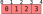
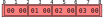
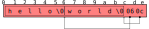
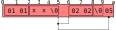

.. sectnum::
.. meta::
   :copyright: Copyright 2007 Allison Karlitskaya
   :license: CC-BY-SA-3.0
..
   This has to be duplicated from above to make it machine-readable by `reuse`:
   SPDX-FileCopyrightText: 2007 Allison Karlitskaya
   SPDX-License-Identifier: CC-BY-SA-3.0

==========================
GVariant Specification 1.0
==========================

.. rubric:: Revision History

Notable changes between versions are listed here. For the full set of changes
and diffs, see the `commit log <https://gitlab.gnome.org/GNOME/glib/-/blob/main/docs/reference/glib/gvariant-specification-1.0.rst>`_.

**Version 1.0, 2007 and 2022-11-01**
   - Convert the original PDF GVariant Specification to version control
   - No semantic or formatting changes
**Version 1.0.1, 2022-11-02**
   - Formatting improvements
   - No semantic changes
**Version 1.0.2, 2024-04-16**
   - Add missing references to ``h`` type string
   - Add missing reference to ``d`` type string to type string grammar

*****
Types
*****

As per requirement, GVariant must be substantially compatible with the D-Bus message
bus system (as specified in the `D-Bus specification <https://dbus.freedesktop.org/doc/dbus-specification.html>`__).

To this end, the type system used in GVariant is almost identical to that used by D-Bus.
Some very minimal changes were made, however, in order to provide for a better system
while still remaining highly compatible; specifically, every message that can by sent over
D-Bus can be represented as a GVariant.

Some baggage has been carried in from D-Bus that would not otherwise have been present
in the type system if it were designed from scratch. The object path and signature types,
for example, are highly D-Bus-specific and would not be present in a general-purpose type
system if it were to be created from scratch.

Differences from D-Bus
======================

In order to increase conceptual clarity some limitations have been lifted, allowing calls
to “never fail” instead of having to check for these special cases.

 * Whereas D-Bus limits the maximum depth of container type nesting, GVariant makes
   no such limitations; nesting is supported to arbitrary depths.
 * Whereas D-Bus limits the maximum complexity of its messages by imposing a
   limitation on the “signature string” to be no more than 255 characters, GVariant
   makes no such limitation; type strings of arbitrary length are supported, allowing
   for the creation of values with arbitrarily complex types.
 * Whereas D-Bus allows dictionary entry types to appear only as the element type of
   an array type, GVariant makes no such limitation; dictionary entry types may exist
   on their own or as children of any other type constructor.
 * Whereas D-Bus requires structure types to contain at least one child type, GVariant
   makes no such limitation; the unit type is a perfectly valid type in GVariant.

Some of the limitations of D-Bus were imposed as security considerations (for example,
to bound the depth of recursion that may result from processing a message from an
untrusted sender). If GVariant is used in ways that are sensitive to these considerations
then programmers should employ checks for these cases upon entry of values into the
program from an untrusted source.

Additionally, D-Bus has no type constructor for expressing the concept of nullability [#f1]_. To
this end, the Maybe type constructor (represented by m in type strings) has been added.

Some of these changes are under consideration for inclusion into D-Bus [#f2]_.

.. [#f1] A “nullable type” is a type that, in addition to containing its normal range of values, also contains a
         special value outside of that range, called ``NULL``, ``Nothing``, ``None`` or similar. In most languages with reference
         or pointer types, these types are nullable. Some languages have the ability to have nullable versions of
         any type (for example, “``Maybe Int``” in Haskell and “``int? i;``” in C#).
.. [#f2] Considerable discussion has been made in face-to-face meetings and some discussion has also occurred
         on the D-Bus mailing list: http://lists.freedesktop.org/archives/dbus/2007-August/008290.html

Enumeration of Types
====================

The Basic Types
---------------

**Boolean**
   A boolean is a value which must be True or False.

**Byte**
   A byte is a value, unsigned by convention, which ranges from 0 to 255.

**Integer Types**
   There are 6 integer types other than byte — signed and unsigned versions of 16, 32
   and 64 integers. The signed versions have a range of values consistent with a two's
   complement representation.

**Double Precision Floating Point**
   A double precision floating point value is precisely defined by IEEE 754.

**String**
   A string is zero or more bytes. Officially, GVariant is encoding-agnostic but the use
   of UTF-8 is expected and encouraged.

**Object Path**
   A D-Bus object path, exactly as described in the
   `D-Bus specification <https://dbus.freedesktop.org/doc/dbus-specification.html#message-protocol-marshaling-object-path>`__.

**Signature**
   A D-Bus signature string, exactly as described in the
   `D-Bus specification <https://dbus.freedesktop.org/doc/dbus-specification.html#message-protocol-marshaling-signature>`__. As this type
   has been preserved solely for compatibility with D-Bus, all of the D-Bus restrictions
   on the range of values of this type apply (eg: nesting depth and maximum length
   restrictions).

Container Types
---------------

**Variant**
   The variant type is a dependent pair of a type (any of the types described in this
   chapter, including the variant type itself) and a value of that type. You might use this
   type to overcome the restriction that all elements of an array must have the same type.

**Maybe**
   The maybe type constructor provides nullability for any other single type. The non-null
   case is distinguished, such that in the event that multiple maybe type constructors
   are applied to a type, different levels of null can be detected.

**Array**
   The array type constructor allows the creation of array (or list) types corresponding
   to the provided element type. Exactly one element type must be provided and all array
   elements in any instance of the array type must have this element type.

**Structure**
   The structure type constructor allows the creation of structure types corresponding
   to the provided element types. These “structures” are actually closer to tuples in the
   sense that their fields are not named, but “structure” is used because that is what
   the D-Bus specification calls them.

   The structure type constructor is the only type constructor that is variadic — any
   natural number of types may be given (including zero and one).

**Dictionary entry**
   The dictionary entry type constructor allows the creation of a special sort of structure
   which, when used as the element type of an array, implies that the content of the array
   is a list of key/value pairs. For compatibility with D-Bus, this binary type constructor
   requires a basic type as its first argument (which by convention is seen to be the key)
   but any type is acceptable for the second argument (by convention, the value).

   Dictionary entries are as such by convention only; this includes when they are put in
   an array to form a “dictionary”. GVariant imposes no restrictions that might normally
   be expected of a dictionary (such as key uniqueness).

Type Strings
============

Just as with D-Bus, a concise string representation is used to express types.

In GVariant, which deals directly with values as first order objects, a type string (by that
name) is a string representing a single type.

Contrast this with “signature strings” [#f3]_ in D-Bus, which apply to messages, and contain
zero or more types (corresponding to the arguments of the message).

.. [#f3] Compare with the whence parameter to the ``lseek()`` system call.

Syntax
------

The language of type string is context free. It is also a prefix code, which is a property
that is used by the recursive structure of the language itself.

Type strings can be described by a non-ambiguous context free grammar.

 * *type* ⇒ *base_type* | *container_type*
 * *base_type* ⇒ **b** | **y** | **n** | **q** | **i** | **u** | **x** | **t** | **h** | **d** | **s** | **o** | **g**
 * *container_type* ⇒ **v** | **m** *type* | **a** *type* | **(** *types* **)** | **{** *base_type* *type* **}**
 * *types* ⇒ ε | *type* *types*

Semantics
---------

The derivation used to obtain a type string from the given grammar creates an abstract
syntax tree describing the type. The effect of deriving through each right hand side
term containing a terminal is specified below:

**b**
   This derivation corresponds to the boolean type.
**y**
   This derivation corresponds to the byte type.
**n**
   This derivation corresponds to the signed 16-bit integer type.
**q**
   This derivation corresponds to the unsigned 16-bit integer type.
**i**
   This derivation corresponds to the signed 32-bit integer type.
**u**
   This derivation corresponds to the unsigned 32-bit integer type.
**x**
   This derivation corresponds to the signed 64-bit integer type.
**t**
   This derivation corresponds to the unsigned 64-bit integer type.
**h**
   This derivation corresponds to the signed 32-bit integer type, representing a handle.
**d**
   This derivation corresponds to the double precision floating point number type.
**s**
   This derivation corresponds to the string type.
**o**
   This derivation corresponds to the object path type.
**g**
   This derivation corresponds to the signature type.
**v**
   This derivation corresponds to the variant type.
**m** *type*
   This derivation corresponds to the maybe type which has a value of ``Nothing`` or ``Just
   x`` for some *x* in the range of *type*.
**a** *type*
   This derivation corresponds to the array type in which each element has the type *type*.
**(** *types* **)**
   This derivation corresponds to the structure type that has the types expanded by
   *types*, in order, as its item types.
**{** *base_type* *type* **}**
   This derivation corresponds to the dictionary entry type that has *base_type* as its key
   type and *type* as its value type.

********************
Serialisation Format
********************

This chapter describes the serialisation format that is used by GVariant. This serialisation
format is newly developed and described for the first time here.

Why not D-Bus?
==============

Since GVariant is largely compatible with D-Bus, it would make sense to use the
serialisation format of D-Bus (plus modifications where appropriate) as the serialisation
format for GVariant.

To do so, however, would conflict with a number of requirements that were established
for GVariant.

Most fundamentally, the requirements would be violated. D-Bus messages are encoded in such
a way that in order to fetch the 100th item out of an array you first have to iterate over
the first 99 items to discover where the 100th item lies. A side effect of this iteration
would be a violation of the requirements.

Additionally, using the D-Bus serialisation format with an API like that mandated by
the requirements would likely imply a violation of the requirements due to the fact that subparts
of D-Bus messages can change meaning when subjected to different starting alignments.
This is discussed in more detail in `Simple Containment`_.

Notation
========

Throughout this section a number of examples will be provided using a common notation
for types and values.

The notation used for types is exactly the type strings described in `Types`_.

The notation used for values will be familiar to users of either Python or Haskell. Arrays
(lists) are represented with square brackets and structures (tuples) with parentheses.
Commas separate elements. Strings are single-quoted. Numbers prefixed with ``0x`` are
taken to be hexadecimal.

The constants ``True`` and ``False`` represent the boolean constants. The nulary data
constructor of the maybe type is denoted ``Nothing`` and the unary one ``Just``.

Concepts
========

GVariant value serialisation is a total and injective function from values to pairs of
byte sequences and type strings. Serialisation is deterministic in that there is only one
acceptable “normal form” that results from serialising a given value. Serialisation is non-
surjective: non-normal forms exist.

The byte sequence produced by serialisation is useless without also having the type
string. Put another way, deserialising a byte sequence requires knowing this type.

Before discussing the specifics of serialisation, there are some concepts that are
pervasive in the design of the format that should be understood.

Byte Sequence
-------------

A byte sequence is defined as a sequence of bytes which has a known length. In all cases,
in GVariant, knowing the length is essential to being able to successfully deserialise
a value.

Byte Boundaries
---------------

Starting and ending offsets used in GVariant refer not to byte positions, but to byte
boundaries. For the same reason that it's possible to have *n + 1* prefixes of a string of
length *n*, there are *n + 1* byte boundaries in a byte sequence of size *n*.

   Byte boundaries

When speaking of the start position of a byte sequence, the index of the starting
boundary happens to correspond to the index of the first byte. When speaking of the
end position, however, the index of the ending boundary will be the index of the last
byte, plus 1. This paradigm is very commonly used and allows for specifying zero-length
byte sequences.

Simple Containment
------------------

A number of container types exist with the ability to have child values. In all cases, the
serialised byte sequence of each child value of the container will appear as a contiguous
sub-sequence of the serialised byte sequence of that container — in exactly the same
form as it would appear if it were on its own. The child byte sequences will appear in
order of their position in the container.

It is the responsibility of the container to be able to determine the start and end (or
equivalently, length) of each child element.

This property permits a container to be deconstructed into child values simply by
referencing a subsequence of the byte sequence of the container as the value of the
child which is an effective way of satisfying the requirements.

This property is not the case for the D-Bus serialisation format. In many cases (for
example, arrays) the encoding of a child value of a D-Bus message will change depending
on the context in which that value appears. As an example: in the case of an array of
doubles, should the value immediately preceding the array end on an offset that is an
even multiple of 8 then the array will contain 4 padding bytes that it would not contain
in the event that the end offset of the preceding value were shifted 4 bytes in either
direction.

Alignment
---------

In order to satisfy the requirement, we must provide programmers with a pointer that they
can comfortably use. On many machines, programmers cannot directly dereference
unaligned values, and even on machines where they can, there is often a performance
hit.

For this reason, all types in the serialisation format have an alignment associated with
them. For strings or single bytes, this alignment is simply 1, but for 32-bit integers (for
example) the alignment is 4. The alignment is a property of a type — all instances of
a type have the same alignment.

All aligned values must start in memory at an address that is an integer multiple of
their alignment.

The alignment of a container type is equal to the largest alignment of any potential
child of that container. This means that, even if an array of 32-bit integers is empty, it
still must be aligned to the nearest multiple of 4 bytes. It also means that the variant
type (described below) has an alignment of 8 (since it could potentially contain a value
of any other type and the maximum alignment is 8).

Fixed Size
----------

To avoid a lot of framing overhead, it is possible to take advantage of the fact that, for
certain types, all instances will have the same size. In this case, the type is said to be a
fixed-sized type, and all of its values are said to be fixed-sized values. Examples are a
single integer and a tuple of an integer and a floating point number. Counterexamples
are a string and an array of integers.

If a type has a fixed size then this fixed size must be an integer multiple of the alignment
of the type. A type never has a fixed size of zero.

If a container type always holds a fixed number of fixed-size items (as in the case of
some structures or dictionary entries) then this container type will also be fixed-sized.

Framing Offsets
---------------

If a container contains non-fixed-size child elements, it is the responsibility of the
container to be able to determine their sizes. This is done using framing offsets.

A framing offset is an integer of some predetermined size. The size is always a power
of 2. The size is determined from the overall size of the container byte sequence. It is
chosen to be just large enough to reference each of the byte boundaries in the container.

As examples, a container of size 0 would have framing offsets of size 0 (since no bits
are required to represent no choice). A container of sizes 1 through 255 would have
framing offsets of size 1 (since 256 choices can be represented with a single byte). A
container of sizes 256 through 65535 would have framing offsets of size 2. A container
of size 65536 would have framing offsets of size 4.

There is no theoretical upper limit in how large a framing offset can be. This fact (along
with the absence of other limitations in the serialisation format) allows for values of
arbitrary size.

When serialising, the proper framing offset size must be determined by “trial and error”
— checking each size to determine if it will work. It is possible, since the size of the
offsets is included in the size of the container, that having larger offsets might bump
the size of the container up into the next category, which would then require larger
offsets. Such containers, however, would not be considered to be in “normal form”. The
smallest possible offset size must be used if the serialised data is to be in normal form.

Framing offsets always appear at the end of containers and are unaligned. They are
always stored in little-endian byte order.

Endianness
----------

Although the framing offsets of serialised data are always stored in little-endian byte
order, the data visible to the user (via the interface mandated by the requirements) is
allowed to be in either big or little-endian byte order. This is referred to as the “encoding
byte order”. When transmitting messages, this byte order should be specified if not
explicitly agreed upon.

The encoding byte order affects the representation of only 7 types of values: those of
the 6 (16, 32 and 64-bit, signed and unsigned) integer types and those of the double
precision floating point type. Conversion between different encoding byte orders is a
simple operation that can usually be performed in-place (but see `Notes on Byteswapping`_ for an
exception).

Serialisation of Base Types
===========================

Base types are handled as follows:

Booleans
--------

A boolean has a fixed size of 1 and an alignment of 1. It has a value of 1 for True or
0 for False.

Bytes
-----

A byte has a fixed size of 1 and an alignment of 1. It may have any valid byte value. By
convention, bytes are unsigned.

Integers
--------

There are 16, 32 and 64-bit signed and unsigned integers. Each integer type is fixed-
sized (to its natural size). Each integer type has alignment equal to its fixed size.
Integers are stored in the encoding byte order. Signed integers are represented in two's
complement.

Double Precision Floating Point
-------------------------------

Double precision floating point numbers have an alignment and a fixed-size of 8.
Doubles are stored in the encoding byte order.

Strings
-------

Including object paths and signature strings, strings are not fixed-sized and have an
alignment of 1. The size of any given serialised string is equal to the length of the string,
plus 1, and the final serialised byte is a nul (0) terminator. The character set encoding
of the string is not specified, but no nul byte is allowed to appear within the content
of the string.

Serialisation of Container Types
================================

Containers are handled as follows:

Variants
--------

Variants are serialised by storing the serialised data of the child, plus a zero byte, plus
the type string of the child.

The zero byte is required because, although type strings are a prefix code, they are not
a suffix code. In the absence of this separator, consider the case of a variant serialised
as two bytes — “ay”. Is this a single byte, ``'a'``, or an empty array of bytes?

Maybes
------

Maybes are encoded differently depending on if their element type is fixed-sized or not.

The alignment of a maybe type is always equal to the alignment of its element type.

Maybe of a Fixed-Size Element
^^^^^^^^^^^^^^^^^^^^^^^^^^^^^

For the ``Nothing`` case, the serialised data is the empty byte sequence.

For the ``Just`` case, the serialised data is exactly equal to the serialised data of the child.
This is always distinguishable from the ``Nothing`` case because all fixed-sized values
have a non-zero size.

Maybe of a Non-Fixed-Size Element
^^^^^^^^^^^^^^^^^^^^^^^^^^^^^^^^^

For the ``Nothing`` case, the serialised data is, again, the empty byte sequence.

For the ``Just`` case, the serialised form is the serialised data of the child element,
followed by a single zero byte. This extra byte ensures that the ``Just`` case is
distinguishable from the ``Nothing`` case even in the event that the child value has a
size of zero.

Arrays
------

Arrays are said to be fixed width arrays or variable width arrays based on if their
element type is a fixed-sized type or not. The encoding of these two cases is very
different.

The alignment of an array type is always equal to the alignment of its element type.

Fixed Width Arrays
^^^^^^^^^^^^^^^^^^

In this case, the serialised form of each array element is packed sequentially, with no
extra padding or framing, to obtain the array. Since all fixed-sized values have a size
that is a multiple of their alignment requirement, and since all elements in the array
will have the same alignment requirements, all elements are automatically aligned.

   An array of 16-bit integers

The length of the array can be determined by taking the size of the array and dividing
by the fixed element size. This will always work since all fixed-size values have a non-
zero size.

Variable Width Arrays
^^^^^^^^^^^^^^^^^^^^^

In this case, the serialised form of each array element is again packed sequentially.
Unlike the fixed-width case, though, padding bytes may need to be added between the
elements for alignment purposes. These padding bytes must be zeros.

After all of the elements have been added, a framing offset is appended for each
element, in order. The framing offset specifies the end boundary of that element.

   An array of strings

The size of each framing offset is a function of the serialised size of the array and the
final framing offset, by identifying the end boundary of the final element in the array
also identifies the start boundary of the framing offsets. Since there is one framing
offset for each element in the array, we can easily determine the length of the array.

.. math::
   length = (size - last\_offset) / offset\_size

To find the start of any element, you simply take the end boundary of the previous
element and round it up to the nearest integer multiple of the array (and therefore
element) alignment. The start of the first element is the start of the array.

Since determining the length of the array relies on our ability to count the number of
framing offsets and since the number of framing offsets is determined from how much
space they take up, zero byte framing offsets are not permitted in arrays, even in the
case where all other serialised data has a size of zero. This special exception avoids
having to divide zero by zero and wonder what the answer is.

Structures
----------

As with arrays, structures are serialised by storing each child item, in sequence,
properly aligned with padding bytes, which must be zero.

After all of the items have been added, a framing offset is appended, in reverse order,
for each non-fixed-sized item that is not the last item in the structure. The framing offset
specifies the end boundary of that element.

The framing offsets are stored in reverse order to allow iterator-based interfaces to
begin iterating over the items in the structure without first measuring the number of
items implied by the type string (an operation which requires time linear to the size
of the string).

   A structure containing 16-bit integers and strings

The reason that no framing offset is stored for the last item in the structure is because
its end boundary can be determined by subtracting the size of the framing offsets from
the size of the structure. The number of framing offsets present in any instance of a
structure of a given type can be determined entirely from the type (following the rule
given above).

The reason that no framing offset is stored for fixed-sized items is that their end
boundaries can always be found by adding the fixed size to the start boundary.

To find the start boundary of any item in the structure, simply start from the end
boundary of the nearest preceding non-fixed-size item (or from 0 in the case of no
preceding non-fixed-sized items). From there, round up for alignment and add the fixed
size for each intermediate item. Finally, round up to the alignment of the desired item.

For random access, it seems like this process can take a time linear to the number of
elements in the structure, but it can actually be performed in a very small constant
time. See `Calculating Structure Item Addresses`_.

If all of the items contained in a structure are fixed-size then the structure itself is fixed-
size. Considerations have to be made to satisfy the constraints that are placed on the
value of this fixed size.

First, the fixed size must be non-zero. This case would only occur for structures of the
unit type or structures containing only such structures (recursively). This problem is
solved by arbitrary declaring that the serialised encoding of an instance of the unit type
is a single zero byte (size 1).

Second, the fixed sized must be a multiple of the alignment of the structure. This is
accomplished by adding zero-filled padding bytes to the end of any fixed-width structure
until this property becomes true. These bytes will never result in confusion with respect
to locating framing offsets or the end of a variable-sized child because, by definition,
neither of these things occur inside fixed-sized structures.

The figure above depicts a structure of type ``(nsns)`` and value ``[257, 'xx', 514, '']``. One
framing offset exists for the one non-fixed-sized item that is not the final item (namely,
the string ``'xx'``). The process of “rounding up” to find the start of the second integer
is indicated.

Dictionary Entries
------------------

Dictionary entries are treated as structures with exactly two items — first the key, then
the value. In the case that the key is fixed-sized, there will be no framing offsets, and
in the case the key is non-fixed-size there will be exactly one. As the value is treated as
the last item in the structure, it will never have a framing offset.

Examples
========

This section contains some clarifying examples to demonstrate the serialisation format.
All examples are in little endian byte order.

The example data is given 16 bytes per line, with two characters representing the
value of each byte. For clarity, a number of different notations are used for byte values
depending on purpose.

 * ``'A`` shows that a byte has the ASCII value of ``A`` (65).
 * ``sp`` shows that a byte is an ASCII space character (32).
 * ``\0`` shows that a byte is a zero byte used to mark the end of a string.
 * ``--`` shows that the byte is a zero-filled padding byte used as part of a structure or
   dictionary entry.
 * ``##`` shows that the byte is a zero-filled padding byte used as part of an array.
 * ``@@`` shows that the byte is the zero-filled padding byte at the end of a ``Just`` value.
 * any two hexadecimal digits show that a byte has that value.

Each example specifies a type, a sequence of bytes, and what value this byte sequence
represents when deserialised with the given type.

**String Example**
   With type ``'s'``::

      'h 'e 'l 'l   'o sp 'w 'o   'r 'l 'd \0

   has a value of ``'hello world'``.

**Maybe String**
   With type ``'ms'``::

      'h 'e 'l 'l   'o sp 'w 'o   'r 'l 'd \0   @@

   has a value of ``Just 'hello world'``.

**Array of Booleans Example**
   With type ``'ab'``::

      01 00 00 01   01

   has a value of ``[True, False, False, True, True]``.

**Structure Example**
   With type ``'(si)'``::

      'f 'o 'o \0   ff ff ff ff   04

   has a value of ``('foo', -1)``.

**Structure Array Example**
   With type ``'a(si)'``::

      'h 'i \0 --   fe ff ff ff   03 ## ## ##   'b 'y 'e \0
      ff ff ff ff   04 09 15

   has a value of ``[('hi', -2), ('bye', -1)]``.

**String Array Example**
   With type ``'as'``::

      'i \0 'c 'a   'n \0 'h 'a   's \0 's 't   'r 'i 'n 'g
      's '? \0 02   06 0a 13

   has a value of ``['i', 'can', 'has', 'strings?']``.

**Nested Structure Example**
   With type ``'((ys)as)'``::

      'i 'c 'a 'n   \0 'h 'a 's   \0 's 't 'r   'i 'n 'g 's
      '? \0 04 05

   has a value of ``(('i', 'can'), ['has', 'strings?'])``.

**Simple Structure Example**
   With type ``'(yy)'``::

      70 80

   has a value of ``(0x70, 0x80)``.

**Padded Structure Example 1**
   With type ``'(iy)'``::

      60 00 00 00   70 -- -- --

   has a value of ``(96, 0x70)``.

**Padded Structure Example 2**
   With type ``'(yi)'``::

      70 -- -- --   60 00 00 00

   has a value of ``(0x70, 96)``.

**Array of Structures Example**
   With type ``'a(iy)'``::

      60 00 00 00   70 -- -- --   88 02 00 00   f7 -- -- --

   has a value of ``[(96, 0x70), (648, 0xf7)]``.

**Array of Bytes Example**
   With type ``'ay'``::

      04 05 06 07

   has a value of ``[0x04, 0x05, 0x06, 0x07]``.

**Array of Integers Example**
   With type ``'ai'``::

      04 00 00 00   02 01 00 00

   has a value of ``[4, 258]``.

**Dictionary Entry Example**
   With type ``'{si}'``::

      'a sp 'k 'e   'y \0 -- --   02 02 00 00   06

   has a value of ``{'a key', 514}``.

Non-Normal Serialised Data
==========================

Nominally, deserialisation is the inverse operation of serialisation. This would imply that
deserialisation should be a bijective partial function.

If deserialisation is a partial function, something must be done about the cases where the
serialised data is not in normal form. Normally this would result in an error being raised.

An Argument Against Errors
--------------------------

The requirements forbids us from scanning the entirety of the serialised byte sequence
at load time; we can not check for normality and issue errors at this time. This leaves
any errors that might occur to be raised as exceptions as the values are accessed.

Faced with the C language's poor (practically non-existent) support for exceptions and
with the idea that any access to a simple data value might possibly fail, this solution
also becomes rapidly untenable.

The only reasonable solution to deal with errors, given our constraints, is to define them
out of existence. Accepting serialised data in non-normal form makes deserialisation
a surjective (but non-injective) total function. All byte sequences deserialise to some
valid value.

For security purposes, what is done with the non-normal values is precisely specified.
One can easily imagine a situation where a content filter is acting on the contents of
messages, regulating access to a security-sensitive component. If one could create a
non-normal form of a message that is interpreted differently by the deserialiser in the
filter and the deserialiser in the security-sensitive component, one could “sneak by”
the filter.

Default Values
--------------

When errors are encountered during deserialisation, lacking the ability to raise an
exception, we are forced into a situation where we must return a valid value of the
expected type. For this reasons, a “default value” is defined for each type. This value
will often be the result of an error encountered during deserialisation.

One might argue that a reduction in robustness comes from ignoring errors and
returning arbitrary values to the user. It should be pointed out, though, that for most
types of serialised data, a random byte error is much more likely to cause the data to
remain in normal form, but with a different value. We cannot capture these cases and
these cases might result in any possible value of a given type being returned to the user.
We are forced to resign ourselves to the fact that the best we can do, in the presence
of corruption, is to ensure that the user receives some value of the correct type.

The default value for each type is:

**Booleans**
   The default boolean value is False.
**Bytes**
   The default byte value is nul.
**Integers**
   The default value for any size of integer (signed or unsigned) is zero.
**Floats**
   The default value for a double precision floating point number is positive zero.
**Strings**
   The default value for a string is the empty string.
**Object Paths**
   The default value for an object path is ``'/'``.
**Signatures**
   The default value for a signature is the nulary signature (ie: the empty string).
**Arrays**
   The default value for an array of any type is the empty array of that type.
**Maybes**
   The default value for a maybe of any type is the ``Nothing`` of that type.
**Structures**
   The default value for a structure type is the structure instance that has for the values
   of each item, the default value for the type of that item.
**Dictionary Entries**
   Similarly to structures, the default value for a dictionary entry type is the dictionary
   entry instance that has its key and value equal to their respective defaults.
**Variants**
   The default variant value is the variant holding a child with the unit type.

Handling Non-Normal Serialised Data
-----------------------------------

On a normally functioning system, non-normal values will not be normally encountered,
so once a problem has been detected, it is acceptable if performance is arbitrarily bad.
For security reasons, however, untrusted data must always be checked for normality as
it is being accessed. Due to the frequency of these checks, they must be fast.

Nearly all rules contained in this section for deserialisation of non-normal data keep this
requirement in mind. Specifically, all rules can be decided in a small constant time (with
a couple of very small exceptions). It would not be permissible, for example, to require
that an array with an inconsistency anywhere among its framing offsets be treated as
an empty array since this would require scanning over all of offsets (linear in the size
of the array) just to determine the array size.

There are only a small number of different sorts of abnormalities that can occur in a
serialised byte sequence. Each of them, along with what to do, is addressed in this
section.

The following list is meant to be a definitive list. If a serialised byte sequence has none
of these problems then it is in normal form. If a serialised byte sequence has any of
these problems then it is not in normal form.

**Wrong Size for Fixed Size Value**
   In the event that the user attempts deserialisation using the type of a fixed-width type
   and a byte sequence of the wrong length, the default value for that type will be used.

**Non-zero Padding Bytes**
   This abnormality occurs when any padding bytes are non-zero. This applies for arrays,
   maybes, structures and dictionary entries. This abnormality is never checked for —
   child values are deserialised from their containers as if the padding was zero-filled.

**Boolean Out of Range**
   In the event that a boolean contains a number other than zero or one it is treated as
   if it were true. This is for purpose of consistency with the user accessing an array
   of booleans directly in C. If, for example, one of the bytes in the array contained the
   number 5, this would evaluate to True in C.

**Possibly Unterminated String**
   If the final byte of the serialised form of a string is not the zero byte then the value
   of the string is taken to be the empty string.

**String with Embedded Nul**
   If a string has a nul character as its final byte, but also contains another nul character
   before this final terminator, the value of the string is taken to be the part of the string
   that precedes the embedded nul. This means that obtaining a C pointer to a string
   is still a constant time operation.

**Invalid Object Path**
   If the serialised form of an object path is not a valid object path followed by a zero
   byte then the default value is used.

**Invalid Signature**
   If the serialised form of a signature string is not a valid D-Bus signature followed by
   a zero byte then the default value is used.

**Wrong Size for Fixed Size Maybe**
   In the event that a maybe instance with a fixed element size is not exactly equal to
   the size of that element, then the value is taken to be ``Nothing``.

**Wrong Size for Fixed Width Array**
   In the event that the serialised size of a fixed-width array is not an integer multiple
   of the fixed element size, the value is taken to be the empty array.

**Start or End Boundary of a Child Falls Outside the Container**
   If the framing offsets (or calculations based on them) indicate that any part of the
   byte sequence of a child value would fall outside of the byte sequence of the parent
   then the child is given the default value for its type.

**End Boundary Precedes Start Boundary**
   If the framing offsets (or calculations based on them) indicate that the end boundary
   of the byte sequence of a child value precedes its start boundary then the child is
   given the default value for its type.

   The end boundary of a child preceding the start boundary may cause the byte
   sequences of two or more children to overlap. This error is ignored for the
   other children. These children are given values that correspond to the normal
   deserialisation process performed on these byte sequences with the type of the child.

   If children in a container are out of sequence then it is the case that this abnormality
   is present. No other specific check is performed for children out of sequence.

**Child Values Overlapping Framing Offsets**
   If the byte sequence of a child value overlaps the framing offsets of the container it
   resides within then this error is ignored. The child is given a value that corresponds
   to the normal deserialisation process performed on this byte sequence (including the
   bytes from the framing offsets) with the type of the child.

**Non-Sense Length for Non-Fixed Width Array**
   In the event that the final framing offset of a non-fixed-width array points to a
   boundary outside of the byte sequence of the array, or indicates a non-integral number
   of framing offsets is present in the array, the value is taken to be the empty array.

**Insufficient Space for Structure Framing Offsets**
   In the event that a serialised structure contains an insufficient space to store the
   requisite number of framing offsets, the error is silently ignored as long as the item
   that is being accessed has its required framing offsets in place. An attempt to access
   an item that requires an offset beyond those available will result in the default value.

Examples
--------

This section contains some clarifying examples to demonstrate the proper
deserialisation of non-normal data.

The byte sequences are presented in the same form as for the normal-form examples.
A brief description is provided for why a value deserialises to the given value.

**Wrong Size for Fixed Size Value**
   With type ``'i'``::

      07 33 90

   has a value of ``0``.

   Since any value with a type of ``'i'`` should have a serialised size of 4, and since only
   3 bytes are given, the default value of zero is used instead.

**Non-zero Padding Bytes**
   With type ``'(yi)'``::

      55 66 77 88   02 01 00 00

   has a value of ``(0x55, 258)``.

   Non-zero padding bytes (``66 77 88``) are simply ignored.

**Boolean Out of Range**
   With type ``'ab'``::

      01 00 03 04   00 01 ff 80   00

   has a value of ``[True, False, True, True, False, True, True, True, False]``.

   Any non-zero booleans are treated as ``True``.

**Unterminated String**
   With type ``'as'``::

      'h 'e 'l 'l   'o sp 'w 'o   'r 'l 'd \0   0b 0c

   has a value of ``['', '']`` (two empty strings).

   The second string deserialises normally as a single nul character, but the first
   string does not contain a nul character. Regardless of the fact that a nul character
   immediately follows it, the first string is replaced with the empty string (the default
   value for strings).

**String with Embedded Nul**
   With type ``'s'``::

      'f 'o 'o \0   'b 'a 'r \0

   has a value of ``'foo'``.

**String with Embedded Nul but None at End**
   With type ``'s'``::

      'f 'o 'o \0   'b 'a 'r

   has a value of ``''`` (the empty string).

   The last byte in the string is always checked to determine if there is a nul and, if not,
   the empty string is used as the value. This includes the case where a nul is present
   elsewhere in the string.

**Wrong Size for Fixed-Size Maybe**
   With type ``'mi'``::

      33 44 55 66   77 88

   has a value of ``Nothing``.

   The only possible way for a value with type ``'mi'`` to be ``Just`` is for its serialised form
   to be exactly 4 bytes.

**Wrong Size for Fixed-Width Array**
   With type ``'a(yy)'``::

      03 04 05 06 07

   has a value of ``[]``.

   With each array element as a pair of bytes, the serialised size of the array should be
   a multiple of two. Since this is not the case, the value of the array is the empty array.

**Start or End Boundary of Child Falls Outside the Container**
   With type ``'(as)'``::

      'f 'o 'o \0   'b 'a 'r \0   'b 'a 'z \0   04 10 0c

   has a value of ``['foo', '', '']``.

   No problems are encountered while unpacking the first element in the array (which
   is marked as falling between byte boundaries 0 and 4). When unpacking the 2nd
   element, its end offset (16) is outside of the bounds of the array. This offset (16) is
   also the start of the 3rd array element. As a result, both of these elements are given
   their default value (the empty string).

**End Boundary Precedes Start Boundary**
   With type ``'(as)'``::

      'f 'o 'o \0   'b 'a 'r \0   'b 'a 'z \0   04 00 0c

   has a value of ``['foo', '', 'foo']``.

   Again, no problems are encountered while unpacking the first element in the array.
   When unpacking the second element it is noticed that the end boundary precedes the
   start. Since this is impossible, the default value of ``''`` is used instead. Unpacking the
   final element (from 0 to 12) occurs without problem. The final element overlaps the
   first element, however, and when assessing its value, the embedded nul character
   causes it to be cut off at ``'foo'``.

**Insufficient Space for Structure Framing Offsets**
   With type ``'(ayayayayay)'``::

      03 02 01

   has a value of ``([3], [2], [1], [], [])``.

   Since this is not a fixed-size value, the fact that it has an impossible size does not cause
   it to receive its default value (ie: there is no concept of “minimum-size”). Unpacking
   the first three items in the structure occurs without a problem (demonstrating that
   the content of a value can overlap the framing offsets). Attempting to unpack the last
   two items fails, however, since the required framing offsets simply do not exist. The
   default values are used instead.

***********************
Implementing the Format
***********************

This chapter contains information about the serialisation format that is not part of its
specification.

This information discusses issues that will arise during implementation of the serialisation
format.

An unfortunate observation is made about the safety of byteswapping operations and a
method is given (along with proof of correctness) that random accesses to the contents of
a structure can be made in constant time, despite the fact that framing offset are omitted
for fixed-sized values.

Notes on Byteswapping
=====================

Implementors may wish to perform in-place byteswapping of serialised GVariant data.
There are a couple of things to consider in this case.

The primary concern arises from the fact that if non-normal serialised data is present
then byteswapping may not be possible.

With a type string of ``(ssn)`` consider the following non-normal serialised data in little-
endian byte order::

   78 00 00 02

The first string has a length of 2 (including the nul terminator) and a value of ``'x'``. The
second string is given its default value of ``''`` as a result of its end offset of 0 preceding
its start offset of 2. Finally, the 16-bit integer, with a start offset of 0 (thus overlapping
the first string) has a value of ``0x78``. The value of the entire structure is ``('x', '', 120)``.

To change this serialised data to be in big-endian byte order requires the swapping of
the bytes of the 16-bit value. To do so, however, would also modify the value of the string
which these bytes overlap. In this case (and in general) there is no way to avoid this
problem.

Because of this problem, any implementation wishing to perform in-place byteswapping
of serialised data must first ensure that the data is in normal form.

There are a couple of cases where this requirement for normal form does not exist. In
the case of any fixed-sized value or variable sized array, no framing offsets are present.
This effectively eliminates the possibility of overlapping data and means that this cases
can be byteswapped in-place without first checking for normality.

Through a fortunate alignment of circumstances, these types (together with strings,
which need not be byteswapped at all) are exactly the sorts of data that an
implementation may wish to make available to the user via a pointer. As a result it is
easy to imagine that an implementation may end up not requiring the ability to in-place
byteswap serialised data except in cases where it is always safe.

Calculating Structure Item Addresses
====================================

In the C language, structures exist in much the same way as they exist in the serialisation
format. Each item in the structure follows the one preceding it as closely as possible,
subject to alignment constraints.

No matter what is done, it is impossible to determine the address of an item in a structure
in C in a constant amount of time. The sizes and alignments of the items preceding it
each need to be considered — a process which can not occur in less than linear time.
The algorithm for doing this is to start at the starting address of the structure and then
for each preceding item in the structure, round up to its alignment requirement and add
its size. Finally, round up to the alignment requirement of the item to be accessed.

This process can be described with a simple algebra containing two types of operations:

 * :math:`(+c)`: add to a natural number, some constant, :math:`c`.
 * :math:`(↑c)`: “align” (round up) a natural number up to the nearest multiple of some constant
   power of two, :math:`2^c`.

Assume that the compiler aligns integer values to their size. To find the address of a 32-
bit integer following a 16-bit integer following an array of 3 64-bit integers, for example,
the following computation must be performed, given the address of the start of the
structure, :math:`s`:

.. math::
   ((↑3);\ (+24);\ (↑1);\ (+2);\ (↑2))\ s

Of course, no modern C compiler saves this computation to be performed at each access.
Instead, the compiler performs the computation at the time of the structure definition
and builds a table containing the starting offset and size of each item in the structure.
Because every item in the structure is of a fixed size and because the start address of
the structure is always appropriately aligned, the address of an item in a structure can
always be specified as a constant relative to the address of the start of that structure.

For our example:

.. math::
   (+28)\ s

Admitting non-fixed-sized items to structures very obviously prevents the starting offset
of items following any non-fixed-sized item from being a constant relative to the start
of the structure. The start address of any item will clearly depend on the end address
of the non-fixed-sized item that most immediately precedes it. Worse than this though,
due to the fact that this end address has no particular alignment, the starting offset of
each item cannot be expressed as a constant offset, even to the end of the non-fixed-
sized item preceding it.

Without discovering another method to build a table, the address computation would
have to be performed, in full, at each access – in linear time. Fortunately, another method
exists, permitting constant-time access to structure members. It is possible to build a
table with each row containing four integers such that this table permits calculating the
start address of any structure item to be performed in only four operations:

.. math::
   ((+a);\ (↑b);\ (+c))\ offsets[i]

Where :math:`offsets` is the array of framing offsets for the structure and :math:`i`, :math:`a`, :math:`b` and :math:`c` are the
four integers from the table. By definition, :math:`offsets[{-1}] = 0`.

Performing the Reduction
------------------------

Essentially, we are interested in a process by which we can reduce any length of
sequence of constant adding and alignment operations to a sequence of length 3, with
the form shown above. We can then perform this small constant number of operations
at each access instead of the full computation.

This reduction process occurs according to the following reduction rules:

**Addition rule**
   :math:`(+a);\ (+b) ⇒ (+(a + b))`

**Greater alignment rule**
   :math:`(↑a);\ (+b);\ (↑c) ⇒ (+(b ↑ a));\ (↑c)`, where :math:`c ≥ a`

**Lesser alignment rule**
   :math:`(↑a);\ (+b);\ (↑c) ⇒ (↑a);\ (+(b ↑ c))`, where :math:`c ≤ a`

We can prove that, using these rules, any sequence of operations can be reduced to
have no more than one alignment operation. If there exist two alignment operations in
the sequence, one of these cases must be true:

 * two alignment operations separated by exactly one addition
 * two adjacent alignment operations
 * two alignment operations separated by more than one addition

In the case that there is exactly one addition separating our two alignment operations
then either the greater or the lesser alignment rule may be immediately applied to
reduce the number of alignment operations by one.

In the case that there are more than one additions, they can be merged down to a single
addition by application of the addition rule before applying one of the alignment rules.
In the case of two adjacent alignment operations, a :math:`(+0)` operation can be introduced
between then before applying one of the alignment rules.

Since we can reduce any sequence of operations to a sequence containing only one
alignment operation, we can further reduce it to the form :math:`(+a);\ (↑b);\ (+c)` by using
the addition rule to merge all of the additions that occur before and after this single
alignment operation.

Computing the Table
-------------------

Based on the reduction rules above, an efficient (but still linear time) algorithm for
computing the entire table at once can be developed.

At all times, the “state so far” is kept as the four variables: :math:`i`, :math:`a`, :math:`b` and :math:`c` such that
getting to the current location is possible by computing :math:`((+a);\ (↑b);\ (+c))` relative to
the :math:`offset[i]`. :math:`i` is kept equal to the index of the framing offset which specifies the end of
the most recently encountered non-fixed-sized item in the structure (or :math:`-1` in the case
that no such item has been encountered). :math:`a`, :math:`b`, :math:`c` start at 0.

Three merge rules are defined to allow any additional operation to be appended to this
sequence without changing the size of the form of the sequence; the merge rules effect
only the integer values of :math:`a`, :math:`b` and :math:`c`.

 1. appending an alignment :math:`d` less than or equal to the current alignment: :math:`(a, b, c) := (a, b, c ↑ d)`
    as a direct result of the lesser alignment rule application :math:`(+a);\ (↑b);\ (+c);\ (↑d) ⇒ (+a);\ (↑b) (+c ↑ d)`.
 2. appending an alignment :math:`d` greater than the current alignment: :math:`(a, b, c) := (a + (c ↑b), d, 0)`
    by the greater alignment rule application :math:`(+a);\ (↑b);\ (+c);\ (↑d) ⇒ (+a);\ (+c ↑ b);\ (↑d)`,
    addition rule application to :math:`(+a + (c ↑ b));\ (↑d)` and harmless appending
    of :math:`(+0)` to give :math:`(+a + (c ↑ b));\ (↑d);\ (+0)`.
 3. appending an addition :math:`e`: :math:`(a, b, c) := (a, b, c + e)` by obvious use of the addition rule
    :math:`(+a);\ (↑b);\ (+c);\ (+e) ⇒ (+a);\ (↑b);\ (+(c + e))`.

Each time a non-fixed-sized item is encountered, :math:`i` is incremented and :math:`a`, :math:`b`, :math:`c` are set
back to zero.

The algorithm is implemented by the following Python function which takes a list of
(alignment, fixed size) pairs as input, representing the structure items. Its output is the
table, given as an array of 4-tuples.

.. code-block:: python

   def generate_table(items):
       (i, a, b, c) = (-1, 0, 0, 0)
       table = []

       for (d, e) in items:
           if d <= b:
               (a, b, c) = (a, b, align(c, d))      # merge rule #1
           else:
               (a, b, c) = (a + align(c, b), d, 0)  # merge rule #2

           table.append ((i, a, b, c))

           if e == -1:                              # item is not fixed-sized
               (i, a, b, c) = (i + 1, 0, 0, 0)
           else:
               (a, b, c) = (a, b, c + e)            # merge rule #3

       return table

It is assumed that ``align(a, b)`` computes :math:`(a ↑ b)`.

Further Reduction
-----------------

The reductions described above are non-confluent. An equivalence on the final
sequence of operations exists. Specifically, if :math:`d` is a multiple of :math:`2^b`, then:

.. math::
   (+a);\ (↑b);\ (+(c + d)) = (+(a + d));\ (↑b); (+c)

This is because, being a multiple of :math:`2^b`, :math:`d` can “pass through” the alignment operation
without change.

Consider, for example, the following:

.. math::
   (n + 16) ↑ 3

It is clear that this is equivalent to

.. math::
   (n ↑ 3) + 16

since there are no low order bits in the binary representation of 16 to be affected by a
rounding operation that clears only the bottom 3 bits.

In the case where only small alignment constraints are encountered (no larger than 8) it
is possible (by shifting multiples of 256 out of :math:`c` into :math:`a`) to ensure that :math:`c` fits into no more
than a single byte. This applies to the serialisation format as specified, considering that
the largest alignment constraint ever encountered is 3.

Plus/And/Or Representation
--------------------------

As a micro-optimisation, after performing the reduction in the previous section, the
resulting values of :math:`a`, :math:`b`, :math:`c` can be transformed such that the calculation can be performed
in only 3 commonly-available machine instructions.

This transformation takes advantage of three simple facts about rounding.

First note that rounding up to the nearest multiple of any number is the same as adding
that number, minus 1, then rounding down to the nearest multiple of that number.

Second, note that rounding down to the nearest multiple of a number that is a power of
two is the same as taking the bitwise and with the bitwise complement of that number
minus 1.

Third, note that the result of rounding to a multiple of a power of 2 results in the
low order bits of the result being cleared. Adding a number less than that multiple to
the result of the rounding can't possibly result in carrying, so using bitwise or is an
equivalent operation.

Keeping in mind that after the reduction in the last section, :math:`c < 2^b`:

.. math::
   ((+a);\ (↑b);\ (+c)\ s) = ((+ (a + 2 - 1));\ (\&\ \sim(2 - 1));\ (|c))\ s)

where :math:`|` denotes bitwise or, :math:`\&` denotes bitwise and, and :math:`\sim` denotes bitwise complement.

We can therefore choose to store the following into the table:

.. math::
   (a + 2^b - 1, \sim(2^b - 1), c)

and for each address we calculate, we are only required to perform an addition, a
bitwise and and a bitwise or.

Proof of Reduction Rules
------------------------

Given a few “intuitive” lemmas, we can prove that the reduction rules are sound.

**Lemma 1**
   .. math::
      \forall{a, b}: (↑a);\ (↑b) = (↑(max(a, b)))

   since alignment is always to powers of two, two successive alignment operations are
   equivalent to the “most powerful” of the two.

**Lemma 2**
   .. math::
      \forall{a, b, c, r}: r = (↑c) ⇒ r(a) + r(b) = r(a + r(b))

   since :math:`r(b)` is already a multiple of :math:`2c` it can “pass through” the second application of
   :math:`r` without change.

**Lemma 3**
   .. math::
      \forall{c}: (0 ↑ c) = 0

Addition Rule
^^^^^^^^^^^^^

Associativity of addition:

.. math::
   \forall{a, b, n}: (n + a) + b = n + (a + b)

which is just the same as:

.. math::
   \forall{a, b, n}: ((+a);\ (+b))\ n = (+(a + b))\ n

By partial instantiation:

.. math::
   \forall{n}: ((+a);\ (+b))\ n = (+(a + b))\ n

and then by extensionality:

.. math::
   (+a);\ (+b) = (+(a + b))

Greater Alignment Rule
^^^^^^^^^^^^^^^^^^^^^^

Let :math:`r = (↑c)` and :math:`s = (↑a)`.

Lemma 2:

.. math::
   \forall{m, n}: s(n) + s(m) = s(s(n) + m)

Lemma 3 allows:

.. math::
   \forall{m, n}: s(n) + s(m) + s(0) = s(s(n) + m)

Repeated application of lemma 2 to the above:

.. math::
   \forall{m, n}: s(n) + s(s(m) + 0) = s(s(n) + m) \\
   \forall{m, n}: s(s(n) + s(m) + 0) = s(s(n) + m)

Which of course is equivalent to:

.. math::
   \forall{m, n}: s(s(n) + s(m)) = s(s(n) + m)

Since addition commutes and we universally quantify over both :math:`m` and :math:`n`, there is no
reason that what works for one won’t work equally well for the other:

.. math::
   \forall{m, n}: s(s(n) + s(m)) = s(n + s(m))

so, clearly:

.. math::
   \forall{m, n}: s(s(n) + m) = s(n + s(m))

Which we can partially instantiate as:

.. math::
   \forall{n}: s(s(n) + b) = s(n + s(b))

It must be true, then, that:

.. math::
   \forall{n}: r(s(s(n) + b)) = r(s(n + s(b)))

Remembering that :math:`r = (↑c)` and :math:`s = (↑a)`:

.. math::
   \forall{n}: ((↑a);\ (↑c))\ ((n ↑ a) + b) = ((↑a);\ (↑c))\ (n + (b ↑ a))

And lemma 1 (since :math:`a ≤ c`) merges this into:

.. math::
   \forall{n}: (↑c)\ ((n ↑ a) + b) = (↑c)\ (n + (b ↑ a)) \\
   \forall{n}: ((↑a);\ (+b);\ (↑c))\ n = ((+(b ↑ a));\ (↑c))\ n

By extensionality:

.. math::
   (↑a);\ (+b);\ (↑c) = (+(b ↑ a));\ (↑c)

Lesser Alignment Rule
^^^^^^^^^^^^^^^^^^^^^

Let :math:`r = (↑a)` and :math:`s = (↑c)`.

Trivially:

.. math::
   \forall{n}: s(r(n) + b) = s(r(n) + b)

From lemma 1, since :math:`c ≤ a`:

.. math::
   \forall{n}: s(s(r(n)) + b) = s(r(n) + b)

Then lemma 2 allows:

.. math::
   \forall{n}: s(r(n)) + s(b) = s(r(n) + b)

Effectively reversing the first application of lemma 1:

.. math::
   \forall{n}: r(n) + s(b) = s(r(n) + b)

Remembering :math:`r = (↑a)` and :math:`s = (↑c)`:

.. math::
   \forall{n}: ((+(b ↑ c));\ (↑a))\ n = ((↑a);\ (+b);\ (↑c))\ n

By extensionality:

.. math::
   (+(b ↑ c)); (↑a) = (↑a); (+b); (↑c)